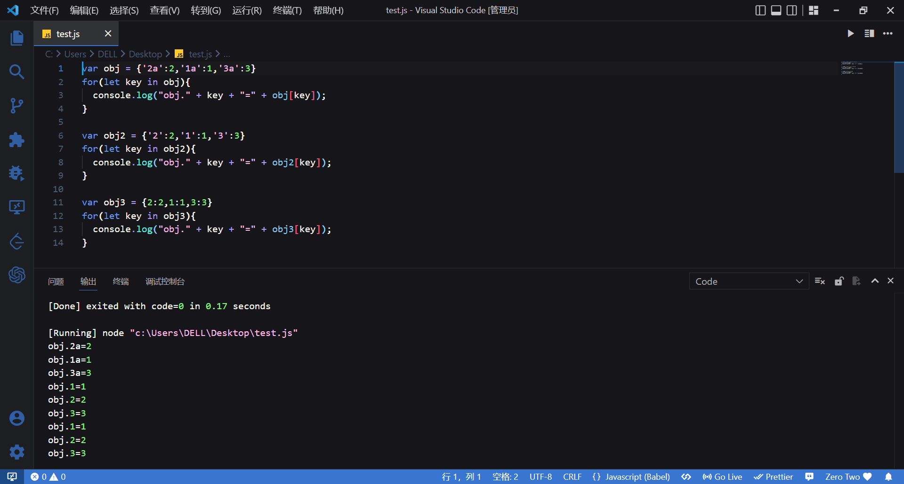

> 安装依赖
```
npm install
```
安装依赖的过程有点慢，请耐心等待。
如果你遇到报错的情况，可能会出现`node install.js`的报错，这是因为安装`electron`时会下载一个包，如果网速慢长时间下载不下来救会报错。你可以切换npm镜像。
```
npm config set electron_mirror "https://npm.taobao.org/mirrors/electron/"
```

> 运行项目
```
npm run dev
```

> 项目介绍
这是一个在线编译markdown的软件，你可以执行对markdown文件的任意操作。例如：新增、删除、修改、编辑。

> 项目技术栈
electron + react hooks + typescript + @reduxjs/toolkit + node.js
electron：用来进行应用夹克、窗口和菜单管理。
react hooks：用来处理项目的逻辑。
typescript：javascript的超集，用来定义类型，使项目更加的可靠。
@reduxjs/toolkit：进行状态管理。
node.js：使用node.js来进行本地目录的监控。

> 项目问题

项目的文件会储存在你的c盘下的文档里面。
关于文件列表的储存我尝试过使用electron-store进行储存，但是这样会导致应用十分的卡顿，于是我使用了localStorage来进行存储。
这些情况您不必担心，后续会使用数据库进行优化。

> 功能增加
1. 左侧文件列表宽度拖拽。拖拽使用的是[re-resizable](https://github.com/bokuweb/re-resizable)
2. 点击左侧文件管理，可以显示和左侧文件列表。
3. 每次进入应用的使用，按照时间排序读取一下目录，获取文件列表，我做过处理，只有在打开的时候才会读取目录，不用担心每次刷新都会重新读取。
3. 使用node监听文件变化，如果在文件中删除、修改、增加，软件中也会跟着进行相应的数据。增加了文件名储存对象，来进行判断，是软件中新增、删除、修改还是本地文件中的新增、删除、修改。
4. 添加日记功能，目前可以通过文字记录日记。
5. 封装了一个日历组件。本来想封装好发布到npm上的，但是目前我还没弄明白要怎么发包。如果需要的话可以直接把src/components/Calendar文件夹提取出来直接使用。你可以使用<Calendar />来进行组件的调用，其中Calendar组件中props的值的类型如下。我是使用react hooks封装的，如果要使用需要使用react hooks
```ts
export interface calendarProps{
  dataList?: string[] | null | undefined//日期列表，是一个数组，例如：['2022-12-10']
  width?: string//日历的宽度
  height?: string//日历的长度
  style?: {}//设置一些样式
  className?: string//className
  dayCilck?: (day:string)=>void//点击日期后的返回函数
}
```
6. 笔友聊天功能。通过@reduxjs/toolkit库中的createAsyncThunk处理异步请求，来储存笔友列表，当点击不同的笔友的时候判断是否已经请求过聊天记录，如果没有则通过createAsyncThunk来处理聊天记录的异步请求，发送消息的时候先请求发送信息的接口，如果成功则通过socket.io想服务器发送消息，然后另一个好友通过socket.io接收消息，发送过socket.io后想redux的state中添加消息。
7. 给好友聊天消息增加了未读消息条数功能，正在聊天的用户不会显示未读，主要是有一段代码我弄了半天。
最开始我是按照下面这样写的，导致了selectUserId一直是undefined，这是因为我给useEffect限制了user，所以selectUserId的值不会更新。
```ts
useEffect(()=>{
    if (socket.current&&user&&user.tokens) {
      socket.current.on("msg-recieve", (msg:{id:number,data:{}}) => {
        dispatch(addMessage(msg));
        // 如果已经打开了该好友的聊天窗口那么就将未读消息清空，且不向redux中添加未读数量
        if(msg.id===selectUserId){
          axios({
            url: '/friend/clearUnread',
            method: 'PUT',
            data: {
              friendId: msg.id
            }
          })
        }else{
          dispatch(addUnread({friendId:msg.id}));
        }
      });
    }
  },[user])
```
最后我改成了下面的代码
```ts
useEffect(()=>{
    if (socket.current&&user&&user.tokens) {
      // 这里取消监听"msg-recieve"，否则会存在多个监听，发送一条信息可以收到好几条
      socket.current.removeListener("msg-recieve");
      socket.current.on("msg-recieve", (msg:{id:number,data:{}}) => {
        dispatch(addMessage(msg));
        // 如果已经打开了该好友的聊天窗口那么就将未读消息清空，且不向redux中添加未读数量
        if(msg.id===selectUserId){
          axios({
            url: '/friend/clearUnread',
            method: 'PUT',
            data: {
              friendId: msg.id
            }
          })
        }else{
          dispatch(addUnread({friendId:msg.id}));
        }
      });
    }
  },[user,selectUserId])
```


> 修改
1. 将数组储存转换成对象存储，如果是数组的话我们每次删除修改都要查找一遍数组，如果是对象的我们可以直接获取到对象中是否有id的值。

2. 使用数组的reduce将用户列表返回的数据变换成对象的类型，其中key值为id的值。

> 遇到的问题

> 1. 当用户修改本地文件中的文件的时候该怎么办？
> 我用了node来读取目录中的文件，只在第一次进入时读取，刷新页面不会重新加载，之后如果再改变目录中的文件时，我使用的时node来监听目录中文件的改变。

> 2. 监听目录的时候，当在软件中改变文件也可以监听到，怎么办？
> 我创建了一个对象来保存全部的文件名称，这样就可以判断是在本地操作的还是软件中操作的，比如修改文件，如果对象中存在修改文件的名称，那么肯定就是在本地操作的。

> 3. 当用户第一次用该软件的时候没有`yun`目录怎么办？
> 我写了一个hooks来判断是否存在`yun`目录，如果没有就创建一个，该hooks只会在进入的时候使用，刷新页面不会重新加载。

> 4. 我的监听目录变化的hooks有点问题，我没有写监听修改的事件，因为修改就是删除一个和新增一个，但是我发现一个问题，就是当修改的时候，删除先监听到了，跟着新增也监听到了，但是删除和新增是一个hooks监听的，但是删除后新增里面没有改变原来的文件列表，就导致了刚才删除的文件再新增后又加了回来。

> 5. 我使用@reduxjs/toolkit的时候不知道怎么在axios拦截器中获取redux中state的信息。然后我经过各种尝试，获取configureStore，然后定义变量为store，可以通过store.getState()来获取configureStore中的信息。如果你已经明白了@reduxjs/toolkit怎么用，你应该能看明白下面的代码。
```ts
import store from '../store';
store.getState().user.userMsg ? 
store.getState().user.userMsg.tokens : null
```
6. 对象的遍历
我现在要使用react遍历一个对象，我使用的Object.key()将对象的key值转换成数组然后进行遍历。
但是使用Object.key()将对象的key值转换成数组后，key值的顺序就变了。
例如：
```ts
let obj = {
  1: '1',
  0: '0',
}
console.log(Object.keys(obj));//[ '0', '1' ]
```
但是我现在需要按照对象中属性的顺序来遍历对象。
其实我可以将对象改成数组，这样遍历数组的顺序就正确了，但是使用对象就是因为对象的值好查找，如果改成数组我查找值的时候还要遍历数组进行查找感觉效果不太好。
```ts
obj[key]//可以使用这种方法来查找对象的值
```
然后我就想维护一个数组和一个对象，数组来进行遍历，对象来进行查找，但是我想起来react的不可变数据，所以当数组改变后，对象的参数关于数组中元素的指向也就不对了。
所以我要怎么才能做到正常顺序的遍历，又做到直接查找不用遍历来查找呢？

解决方法：
我们先来看下面的一张图片。

所以，我只要将对象的key值变成字符串，并且往后面加一个非数字的字符串。